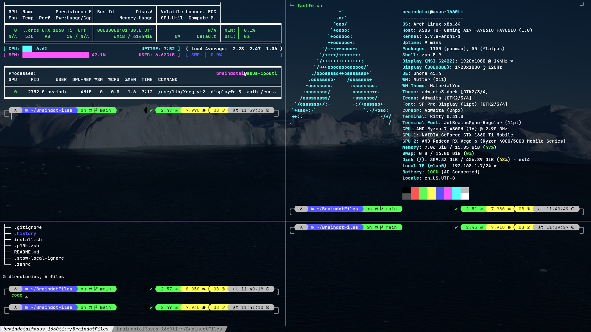

# __BraindotFiles__



## __Installation__

Just run:

```
wget -qO- https://raw.githubusercontent.com/braindotai/BraindotFiles/main/install.sh | bash
```

**Supported distros:**
- Arch
- Ubuntu

This script installs the following

- **Stow:** To maintain simlinks.
- **Zsh**: Terminal Shell
    - oh-my-zsh: Framework for managing your Zsh configuration
    - zsh plugins:
        - zsh-autosuggestions
        - zsh-syntax-highlighting
        - zsh-autocomplete
- **Powerlevel10k**: Terminal Shell theme
- **Kitty**: GPU based terminal emulator
    - Custom kitty configuration
    - Dark Pastel theme
- **Fonts**: For shell and terminal emulator
    - JetBrains Mono Fonts: For kitty terminal
    - MesloLGS: For oh-my-zsh

